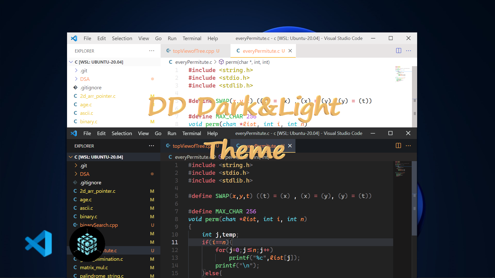
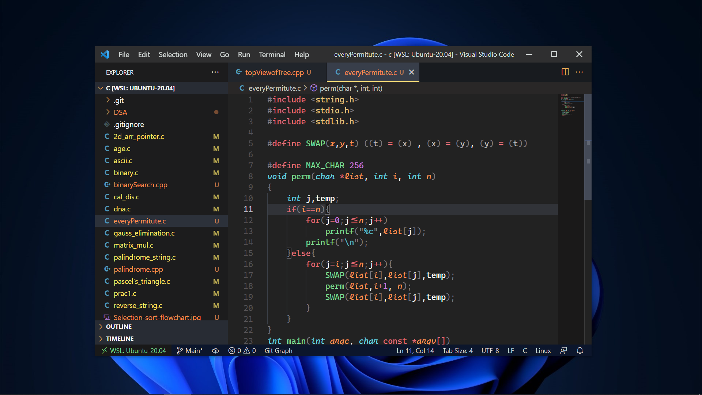
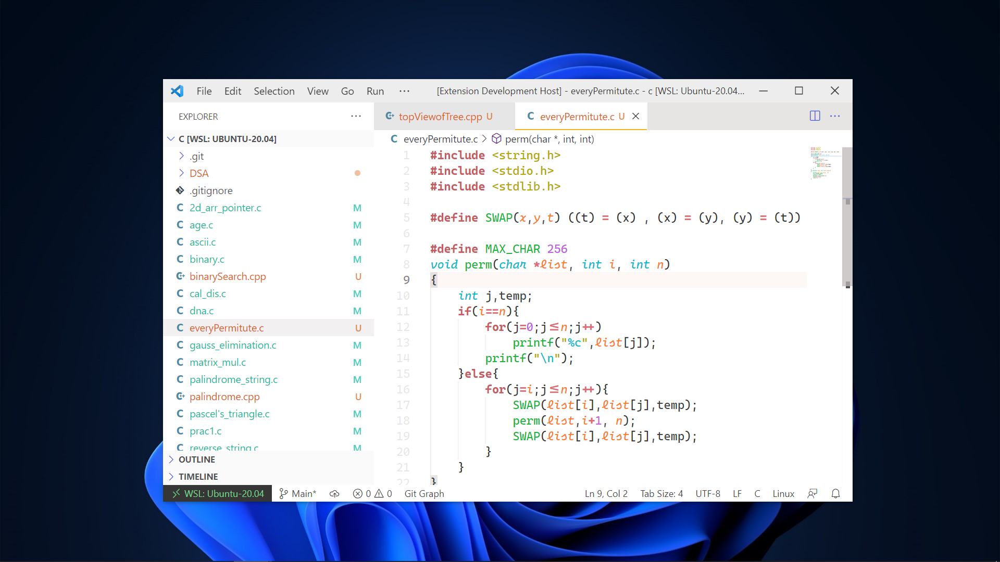

# DD-Light-Dark Theme
By `Dipankar Das`



<hr>


[](http://commonmark.org)


# SCREENSHOT
## Dark Theme


<br>

## Light Theme


🎉✨

To turn on Font Ligatures
Ctrl + Shift + P => Settings.json
ans Paste this

some of the suggest `settings.json`
```json
"editor.fontLigatures": "true",
"editor.fontSize": 15,
"editor.fontFamily": "Cascadia Code",
```

To get the bracketPairColorization 
Ctrl + Shift + P => Settings.json
ans Paste this
```json
"editor.bracketPairColorization.enabled": true,
```

<hr>

## Installation & Applying

This theme can be installed by clicking on Ctrl + Shift + X on Windows or ⇧ + ⌘ + X on Mac and then searching for "Dipankar theme".

To apply clicking on Ctrl + K + T on Windows or ⇧ + K + T on Mac and then apply the theme you want.

## How to contribute

This will allow me or any contributor to easily add/suggest new theme variants or changes to the existing ones. In `./themes/` folder you will find:
    see the `./CONTRIBUTION.md` file


## CHANGELOG
[**github link**](https://github.com/dipsonu10/dark-theme-custom/blob/main/CHANGELOG.md)


## Profile View Counter


### Contributors Badge
<a href="https://github.com/dipsonu10/dark-theme-custom/graphs/contributors">

</a>
Made with [contributors-img](https://contrib.rocks).

❤ `Happy coding`

## Credits

This theme was inspired by the themes [VS Dark](https://github.com/Microsoft/vscode/tree/master/extensions/theme-defaults/themes), [Monokai Pro](https://marketplace.visualstudio.com/items?itemName=monokai.theme-monokai-pro-vscode), [One Dark](https://github.com/atom/atom/tree/master/packages/one-dark-syntax)

**Enjoy!**
